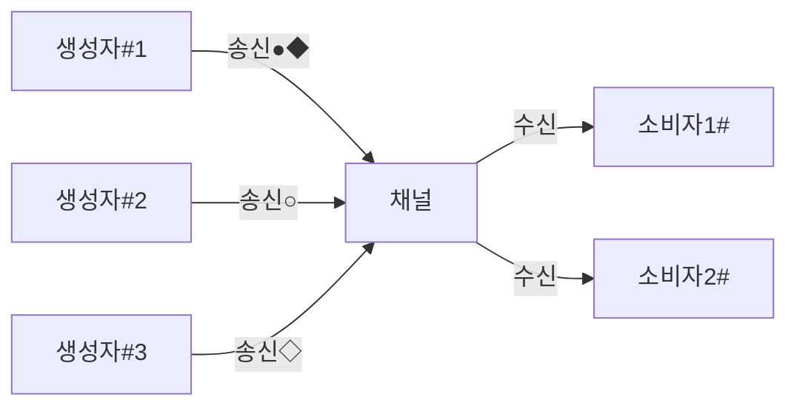

github markdown으로 flow chart나 diagram을 작성할 수 있는 plugin이 추가된 것 같다.

​

<https://github.blog/2022-02-14-include-diagrams-markdown-files-mermaid/>
> [**Include diagrams in your Markdown files with Mermaid**](https://github.blog/2022-02-14-include-diagrams-markdown-files-mermaid/)
>
> Mermaid is a JavaScript based diagramming and charting tool that takes Markdown-inspired text definitions and creates diagrams dynamically in the browser.


github code 입력시 kotlin인지 java인지 입력하는 부분이 있었는데 여기에 지시어를 입력하고 작성하면 github 에 작성한 markdown에 diagram flowchart등이 작성되는 것같다.

​

<https://mermaid.js.org/syntax/flowchart.html>
> [**Flowcharts Syntax | Mermaid**](https://mermaid.js.org/syntax/flowchart.html)
>
> Flowcharts - Basic Syntax ​ Flowcharts are composed of nodes (geometric shapes) and edges (arrows or lines). The Mermaid code defines how nodes and edges are made and accommodates different arrow types, multi-directional arrows, and any linking to and from subgraphs. WARNING If you are using the wor...


chart 종류가 꽤 다양한 것 같다.

​

[Flowchart](https://mermaid.js.org/syntax/flowchart.html)

[Sequence Diagram](https://mermaid.js.org/syntax/sequenceDiagram.html)

[Class Diagram](https://mermaid.js.org/syntax/classDiagram.html)

[State Diagram](https://mermaid.js.org/syntax/stateDiagram.html)

[Entity Relationship Diagram](https://mermaid.js.org/syntax/entityRelationshipDiagram.html)

[User Journey](https://mermaid.js.org/syntax/userJourney.html)

[Gantt](https://mermaid.js.org/syntax/gantt.html)

[Pie Chart](https://mermaid.js.org/syntax/pie.html)

[Quadrant Chart](https://mermaid.js.org/syntax/quadrantChart.html)

[Requirement Diagram](https://mermaid.js.org/syntax/requirementDiagram.html)

[Gitgraph (Git) Diagram](https://mermaid.js.org/syntax/gitgraph.html)

[C4 Diagram 🦺⚠️](https://mermaid.js.org/syntax/c4.html)

[Mindmaps](https://mermaid.js.org/syntax/mindmap.html)

[Timeline](https://mermaid.js.org/syntax/timeline.html)

[Zenuml](https://mermaid.js.org/syntax/zenuml.html)

[Sankey](https://mermaid.js.org/syntax/sankey.html)

[XYChart 🔥](https://mermaid.js.org/syntax/xyChart.html)

[Block Diagram 🔥](https://mermaid.js.org/syntax/block.html)

[Other Examples](https://mermaid.js.org/syntax/examples.html)

​

이걸 이용해서 현재 작성해본 내용은 아래와 같이 잘 나온다.

​


```



```


                                        


​

markdown으로 이런 chart 등을 입력하려고 할 때, 여간 정성을 많이 들여야 되는 경우가 있었는데, 간편하게 작성할 수 있는 방법을 알게되어서 자주 써먹을 것 같다.